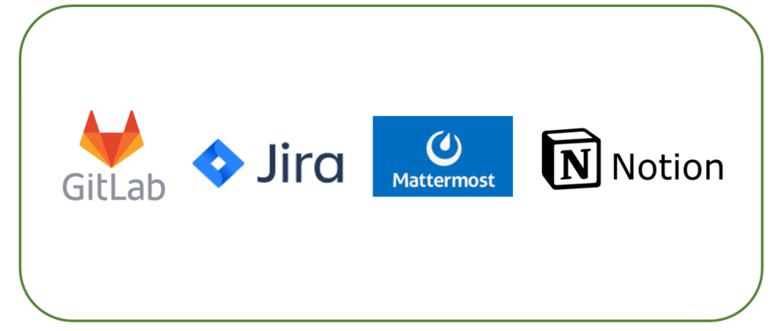

## 모여봐요 동문의 숲

#### 📑 목차

[TOC]

#### 🎉 프로젝트 소개

프로젝트 기간(6주) : 2022/4/11 ~ 2022/05/20

참여 인원(6명) : 김남욱, 김나린, 이호열, 이진석, 이제훈, 임채은


#### 🎆 기획배경

> 그 때 그 시절 친구들, 메타버스 안에서 만나 추억을 즐겨보자!
> 메타버스를 활용한 동문회 서비스 모여봐요 동문의 숲
>
> [모동문](https://k6b1031.p.ssafy.io/)


#### 🎞 UCC

[모여봐요 동문의 숲 UCC](https://www.youtube.com/watch?v=XYEWwd-bj9k)


####  💻 주요 기능

| 구분 | 기능                    | 설명                                                         |  비고   |
| :--: | ----------------------- | ------------------------------------------------------------ | :-----: |
|  1   | 자유 게시판             | 자유롭게 글을 쓸 수 있는 게시판입니다. <br />친구를 찾거나, 그때 하지 못했던 말들을 할 수 있습니다. |         |
|  2   | 일정 게시판             | 온라인에서 충분히 만남을 즐겼다면, 실제로 만나보는건 어떨까요? <br />장소, 시간을 정하고 참여 인원을 확정하여 만남을 주선해볼 수 있습니다. |         |
|  3   | 터져라 등록금! 불꽃놀이 | 옥상에서 불꽃놀이를 보며, 루프탑 카페에 온 것처럼 휴식을 취할 수 있습니다. |         |
|  4   | 채팅                    | 동시 접속한 유저들과 함께 채팅으로 의사소통을 할 수 있습니다. | 수정 중 |
|  5   | 사진 촬영               | 찰칵! 메타버스 내에서 만난 친구들과 학교를 배경으로 사진을 찍을 수 있습니다. |         |


#### 🎮 세부 기능

| 구분 | 기능                   | 설명                                                         |  비고   |
| :--: | ---------------------- | ------------------------------------------------------------ | :-----: |
|  1   | 소셜 회원가입 / 로그인 | 카카오톡 소셜 회원 관리 기능을 사용합니다.                   |         |
|  2   | 멀티 플레이            | Photon Cloud를 통해 ~~100~~20ccu 동시 접속이 가능합니다.     |         |
|  3   | 캐릭터 선택            | 접속 시 총 12개의 캐릭터 중 하나를 고를 수 있습니다.         |         |
|  4   | 캐릭터 상호작용        | 달리기, 점프 등 다양한 동작 표현이 가능합니다.               |         |
|  5   | 맵 상호작용            | 게시판, 사진 촬영, 불꽃 놀이 등 웹 기능들을 사용할 수 있습니다. |         |
|  6   | 추억의 교과서          | 추억의 교과서를 보며 추억을 즐길 수 있습니다.                |         |
|  7   | 기억나니...주기율표?   | 주기율표를 맞춰볼 수 있습니다. 수헬리베 붕탄질산..<br />모두 성공 시 성공 메시지가 출력됩니다. |         |
|  8   | 대세는 축농구          | 축구와 농구를 동시에 즐길 수 있습니다.                       | 수정 중 |
|  9   | 뚱땅뚱땅 음악교실      | 자유롭게 음악을 연주해볼 수 있습니다.                        | 수정 중 |
|  10  | 나는야 피카소          | 이 순간 만큼은 피카소, 자유롭게 그림을 그릴 수 있습니다.     | 수정 중 |
|  11  | 추억의 게시판          | 사진 업로드, 감상을 통해 추억에 잠길 수 있습니다.            | 수정 중 |


#### 🛠 설치 및 사용방법

- 순서대로 진행해주세요.

- git clone

  ``` git
  1. 클론을 원하는 폴더 생성
  2. 해당 폴더에서 git bash open
  3. git clone https://lab.ssafy.com/s06-final/S06P31B103.git

- Frontend

  ``` vue
  npm install
  npm run build
  ```

- Backend
  보안 사유 : application.yml 생략

  backend/src/main/resources/하위에 aws, s3 관련 설정 키 값들이 추가된 설정 파일이 위치해야 합니다.

  ```java
  spring boot 실행
  ```

- 모여봐요 동문의 숲 페이지로 접속


#### 🧱 애플리케이션 아키텍처


- Vue & Unity : 연동으로 가상 공간 구축
- Photon : 100CCU 유료 클라우드 -> 튕김 이슈로 인해 20CCU 무료 free cloud 활용 중
- WebGL : Vue & Unity 간 통신에 필수. **호환 버전 확인 필수**
- Docker : 독자 환경 구성
- Jenkins : CI/CD 구축


#### ⚙ 개발 환경

| Parts    | Skills                                              | ETC                                |
| -------- | --------------------------------------------------- | ---------------------------------- |
| Frontend | Javascript(ES6), Vue, Vuex, axios, tailwindCSS      | Visual Studio Code                 |
| Backend  | Java, SpringBoot, Lombok, JPA, JWT, Security, OAuth | IntelliJ, Mysql workbench, Postman |
| Unity    | Unity, WebGL,                                       | Visual Studio                      |
| Deploy   | AWS EC2, S3, Docker, Jenkins, Nginx                 | MobaXterm                          |


#### 🔌 협업툴



- Gitlab : 형상 관리
- Jira : 이슈 관리
- Mattermost : 소통 관리
- Notion : 전체적인 일정, 학습자료 공유


#### 🔗 팀원

| 팀원   | 역할       |
| ------ | ---------- |
| 김남욱 | BE, 팀장   |
| 김나린 | BE, S3     |
| 이호열 | BE, 배포   |
| 이진석 | FE, Unity  |
| 이제훈 | FE, Vue    |
| 임채은 | FE, Photon |

