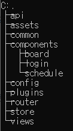
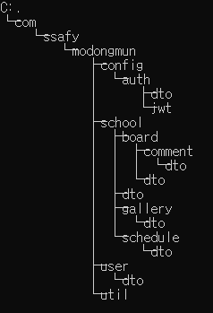
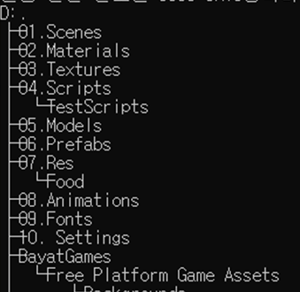

## 📚 기술 스택

1. 형상 관리 : Gitlab
2. 이슈 관리 : Jira
3. 소통 관리 : 
   - Notion 
   - Mattermost
   - Webex 42.5.0.22221
4. 디자인 : Figma
5. 개발 환경
   1. **Frontend**
      - Javascript(ES6)
      - Vue 2.6.14
      - Vuex 3.6.2
      - AXIOS 0.27.2
      - Tailwindcss 3.0.24
   2. **Backend**
      - Java 11
      - SpringBoot 2.5.4
      - Lombok 1.18.20
      - JPA 2.5.4
      - Postman v9.15.13
      - JWT 3.16.0
      - Security 5.5.2
      - OAuth 2.5.4
      - JUnit 4.13.1
      - Spring Cloud Starter-aws 2.2.6 RELEASE
      - h2 1.4.200
   3. **Unity**
      - Unity 2021.3.1f1
      - Unity-WebGL 2.0.2
      - Photon Cloud 2.4
   4. **Deploy**
      - AWS EC2(ubuntu 20.04)
      - S3
      - Docker
      - Jenkins
      - Nginx
6. IDE & Tool
   - intelliJ 2021.3.2
   - MySql Workbench 8.0
   - Visual Studio Code 2019
   - MobaXterm v21.5
7. Edit UCC 
   - Movavi Video Editor Plus 2020


## 💾 프로젝트 파일 구조

#### 🎨 Frontend



#### 🧶 Backend



#### 🧵 Unity



## 🖼 빌드 및 배포

정말 0에서부터 시작하면 어떻게 하는지 정리하는게 좋을듯

- Build
  - Frontend
  
    ``` javascript
    cd ../frontend
    npm install
    npm run build
    npm run serve
    ```
  
  - Backend
  
    ``` java
    cd ../backend;
    ./gradlew build;
    chmod?
    ```
  
- Deploy
  - Frontend
  - Backend
    - Docker install
    - Docker - MySQL install
    - Docker - Jenkins install
    - Jenkins - Gitlab connect
    - Publish over SSH 설정 - 원격배포
    - //출처

<br/>

---

### 📑 접속 정보 파일 목록

​	📁 resources

​		└ application.yml <br/>
​		└ application-aws.yml <br/>
​		└ application-oauth.yml <br/>
​		└ application-prod.yml <br/>
​		└ application-test.yml <br/>
