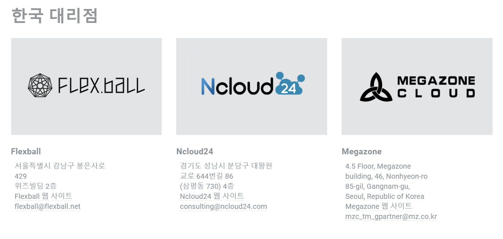

## 외부 서비스 문서

### 🎭 Frontend

- Vue & Vuex

  ```vue
  npm install -g @vue/cli 
  ```
  
- Axios

  ``` vue
  npm install axios
  ```

- TailwindCSS

  ``` vue
  npm install -D tailwindcss@latest postcss@latest autoprefixer@latest
  ```

- unity-webgl

  ``` vue
  npm install unity-webgl
  ```
  


### 🩺 Backend

- JPA

  - build.gradle에 의존성 등록

    - "org.springframework.boot:spring-boot-stater-data-jpa", "com.h2database:h2"

      ```java
      dependencies {
      	implementation 'org.springframework.boot:spring-boot-starter-web'
      	implementation 'org.springframework.boot:spring-boot-starter-data-jpa'
      	compileOnly 'org.projectlombok:lombok'
      	runtimeOnly 'com.h2database:h2'
      	annotationProcessor 'org.projectlombok:lombok'
      	testImplementation('org.springframework.boot:spring-boot-starter-test') {
      		exclude group: 'org.junit.vintage', module: 'junit-vintage-engine'
      	}
      }
      ```

- S3

  - 버킷 생성

  - 정책 생성

  - IAM 관리용 사용자 만들기

  - 정책 연결

  - Spring Boot 연결

    - build.gradle 추가

      ```java
      implementation 'org.springframework.cloud:spring-cloud-starter-aws:2.2.6.RELEASE'
      ```

    - AmazonS3config 등록

    - application-aws.yml 등록

- jwt, security, oauth


### 🧨Unity

- Unity

- Asset
  - 캐릭터
    - https://assetstore.unity.com/packages/3d/characters/humanoids/characters-6-07-218241
  - 교실
    - https://assetstore.unity.com/packages/3d/environments/simplepoly-school-interiors-low-poly-assets-97751
    - https://assetstore.unity.com/packages/3d/props/interior/low-poly-interior-16-educational-208677
    - https://assetstore.unity.com/packages/3d/environments/playground-low-poly-191533#publisher
  - 그 외
    - https://assetstore.unity.com/packages/3d/cola-can-96659
    - https://assetstore.unity.com/packages/3d/props/coffeeshop-starter-pack-160914
    - https://assetstore.unity.com/packages/3d/props/furniture/summer-open-air-table-and-chair-94677
    - https://assetstore.unity.com/packages/3d/vehicles/land/school-bus-simple-isometric-106250
    - https://assetstore.unity.com/packages/2d/gui/icons/cherry-blossom-gui-pack-147391
    - https://assetstore.unity.com/packages/2d/textures-materials/sky/free-stylized-skybox-212257
    - https://assetstore.unity.com/packages/2d/textures-materials/sky/fantasy-skybox-free-18353
    - https://assetstore.unity.com/packages/3d/props/weapons/fireworks-101035

- bgm
  - [공유 마당](https://gongu.copyright.or.kr/gongu/main/main.do)
    - https://gongu.copyright.or.kr/gongu/wrt/wrt/view.do?wrtSn=13048800&menuNo=200020
    - https://gongu.copyright.or.kr/gongu/wrt/wrt/view.do?wrtSn=13048724&menuNo=200020
    - https://gongu.copyright.or.kr/gongu/wrt/wrt/view.do?wrtSn=13048782&menuNo=200020
    - https://gongu.copyright.or.kr/gongu/wrt/wrt/view.do?wrtSn=13073805&menuNo=200020
    
- Photon Cloud
  - 포톤 클라우드 회원가입 진행
    https://id.photonengine.com/
  - 서비스에 맞는 제품 선정
  - 관리화면 - 새 어플리케이션으로 무료 ccu 생성
    - 유료 ccu 업데이트 원할 시 한국 대리점에 문의 후 진행 <br/>
      https://www.photonengine.com/ko-KR/contact<br/>
      
      - Ncloud24 추천 - 문의 및 응대가 빠름.
  
  - connect
    - 포톤 PUN2 사용
      - https://assetstore.unity.com/packages/tools/network/pun-2-free-119922
    - Photon Server Settings  
        
    - 연결 방법
      ```c#
      void Start()
      {
          Debug.Log("서버 연결중...");
          PhotonNetwork.ConnectUsingSettings();  // 네트워크 설정하기
      }

      public override void OnConnectedToMaster()  // 서버 연결 후 동작
      {
          Debug.Log("서버 연결 완료");
          PhotonNetwork.JoinLobby();  // 로비 입장하기
      }
      ```

  - Webgl
    - 빌드
      - File > Build Settings  
          
      - Edit > Project Settings > Player > Publising Settings  
          
      - 빌드된 파일 포맷 형식  
          

    - Vue 연결
      ```javascript
      import UnityWebgl from "unity-webgl";

      const Unity = new UnityWebgl({
        loaderUrl: "/Build/Build.loader.js",
        dataUrl: "/Build/Build.data",
        frameworkUrl: "/Build/Build.framework.js",
        codeUrl: "/Build/Build.wasm",
      });

      export default {
        components: {
          Unity: UnityWebgl.vueComponent,
        },
      };
      ```


### 🎁 Nginx setting & SSL 인증서

- Nginx 세팅

  ``` ubuntu
  sudo apt update
  sudo apt install nginx
  ```

  

- SSL 인증서 설치

  - Certbot 활용

    - ubuntu 20.04에 snapd 설치 유무 체크

    - snapd 버전 업데이트

      ```java
      sudo snap install core; sudo snap refresh core
      ```

    - apt, dnf, yum으로 certbot 설치 시 삭제 진행

      ```ubuntu
      sudo apt-get remove certbot
      ```

    - certbot install

      ``` ubuntu
      sudo snap install --classic certbot
      ```

    - certbot 명령 실행 가능 여부 확인

      ``` ubuntu
      sudo ln -s /snap/bin/certbot /usr/bin/certbot
      ```


### 🎑 PORTS 정리

```java
```

